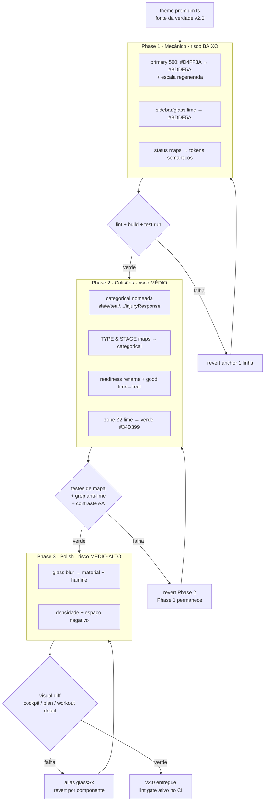

# Migração para o sistema de cores Premium v2.0

> **Tipo:** refactor de design system (sem mudança de lógica de domínio)
> **Fonte da verdade:** `theme.premium.ts` (tokens v2.0). Não inventar cores — consumir os tokens como definidos.
> **Status:** proposta (spec). **Não** inclui implementação.

---

## 1. Summary + goals/non-goals

### Summary

O sistema de cores atual sobrecarrega o lime `#D4FF3A` com quatro significados simultâneos
(brand, ação primária, readiness 70–89, zona Z2 e a etapa "principal") e reusa hues
semânticos (`danger`/`warning`/`success`/`info`) como cores **categóricas** de tipo/etapa de
treino. O resultado é ambiguidade visual: um chip vermelho é ao mesmo tempo "erro" e
"INTERVALADO"; o lime perde valor de marca por estar em todo lugar; e o conjunto neon +
glass(blur) lê como *energy-drink*, não *instrument-grade*.

A v2.0 (`theme.premium.ts`) resolve isso retunando o lime para `#BDDE5A` e restringindo-o a
**brand + ação primária**, movendo tipos/etapas para uma paleta `categorical` dedicada
(vermelho puro reservado a lesão), e empurrando a direção visual para *restraint*, hairlines e
material em vez de glow.

Esta mudança é **mecânica e de baixo risco no núcleo** (substituição de valores de token) e
**de média complexidade nas colisões** (separar categórico de semântico). Nenhuma lógica
*backend-owned* muda.

### Os 3 problemas que este refactor resolve

1. **Color overload.** Hoje `primary[500] = #D4FF3A` significa brand **e** ação primária **e**
   readiness `high` (70–89) **e** zona Z2 **e** etapa `principal`. Na v2.0 lime = **brand +
   ação apenas**, retunado para `#BDDE5A`. As outras três menções de lime são removidas.
2. **Colisão semântico/categórico.** `WORKOUT_TYPE_COLORS` e `WORKOUT_STAGE_COLORS` usam
   `semantic.danger/warning/success/info`, e `categorical.cat1/cat2/cat3` são *literalmente os
   mesmos hexes* dos semânticos (`cat1 = #3B82F6 = info`, `cat2 = #10B981 = success`,
   `cat3 = #F59E0B = warning`). Um chip vermelho é ambíguo entre "erro" e "INTERVALADO". A v2.0
   move tipos/etapas para `categorical` dedicado (slate/teal/cyan/violet/magenta/coral/gold/sage)
   e reserva vermelho puro só para `injuryResponse`.
3. **Premium drift.** Neon lime + glass pesado (`blur(10px)` + white-alpha 8–15%) custa
   legibilidade/perf no cockpit denso e diverge do alvo *material + hairline*. Direção:
   *restraint*, hairlines, material sobre glow.

### Goals

- Migrar o núcleo de tokens (`design-tokens/colors.ts`, `theme/tokens.ts`, `App.tsx`) para os
  valores e a estrutura da v2.0.
- Garantir que **componentes referenciem tokens semânticos/de papel**, nunca hex cru.
- Tornar a disciplina de lime e a separação categórico↔semântico **verificáveis em CI**.

### Non-goals

- **Não** alterar lógica *backend-owned*: thresholds de readiness e a derivação TSB→Form
  permanecem do domínio/backend; a UI só renderiza o valor resolvido.
- **Não** mudar a rampa de calor convencional das zonas Z1–Z5 (convenção de domínio). **Apenas
  Z2** muda (lime → verde) — intencional, não um deslize.
- **Não** introduzir Tailwind nem CSS color vars. Tokens seguem TypeScript + MUI dark.
- **Não** remover `info` (`#3B82F6`) como token funcional de UI — ele apenas **nunca** pode
  alcançar superfícies de brand/hero.

---

## 2. Token remap table

Toda cor/papel atual → token v2.0, com razão. (Hexes atuais extraídos de
`src/shared/design-tokens/colors.ts`, `src/theme/tokens.ts`, `src/shared/theme/workoutColors.ts`.)

### 2.1 Primary scale (brand lime)

| Token atual | Valor atual | Token v2.0 | Valor v2.0 | Razão |
|---|---|---|---|---|
| `primary[500]` | `#D4FF3A` | `primary[500]` | `#BDDE5A` | Lime retunado (tamed). Anchor da escala. |
| `primary[400]` | `#CFFF4D` | `primary[400]` | `#C7E373` | Escala regenerada em torno do novo anchor. |
| `primary[600]` | `#A8CC2E` | `primary[600]` | `#94B144` | Hover/active. |
| `primary[50..900]` | escala neon | `primary[50..900]` | escala tamed | Substituição direta valor-a-valor. |
| `primary.contrastText` | `surface[900]` `#0A1628` | `primary.contrastText` | `#0A1628` | Texto navy sobre lime — inalterado. |

### 2.2 Readiness (prontidão)

| Token atual | Valor atual | Token v2.0 | Valor v2.0 | Razão |
|---|---|---|---|---|
| `readiness.low` | `#EF4444` | `readiness.critical` | `#EF4444` | Rename de chave; valor mantido. |
| `readiness.medium` | `#F59E0B` | `readiness.caution` | `#F59E0B` | Rename; valor mantido. |
| `readiness.high` | `#D4FF3A` (lime) | `readiness.good` | `#2DD4BF` (teal) | **Lime removido** — brand ≠ readiness. |
| `readiness.peak` | `#10B981` | `readiness.optimal` | `#10B981` | Rename; valor mantido. |

> Thresholds (`<40 / <70 / <90`) são *backend-owned*. `readinessColor()` no front só renderiza
> a banda resolvida — **uma** fonte de verdade.

### 2.3 Training types (`WORKOUT_TYPE_COLORS`)

| Tipo | Token atual | Hex atual | Token v2.0 | Hex v2.0 | Razão |
|---|---|---|---|---|---|
| `FACIL` | `surface[400]` | `#94A3B8` | `categorical.slate` | `#8694A8` | Calmo/baixa energia. |
| `LONGO` | `categorical.cat1` | `#3B82F6` | `categorical.teal` | `#2BB6A3` | Endurance; sai do azul=info. |
| `TEMPO` | `semantic.warning[500]` | `#F59E0B` | `categorical.coral` | `#F2845C` | **Sai do amber semântico.** |
| `INTERVALADO` | `semantic.danger[500]` | `#EF4444` | `categorical.magenta` | `#E0529C` | **Sai do vermelho** (não é "erro"). |
| `REGENERATIVO` | `semantic.success[500]` | `#10B981` | `categorical.sage` | `#7FB894` | **Sai do verde sucesso.** |
| `FARTLEK` | `categorical.cat4` | `#A855F7` | `categorical.violet` | `#A855F7` | Variado/lúdico — valor mantido. |
| `CONTINUO` | `semantic.warning[400]` | `#FBBF24` | `categorical.gold` | `#E8C547` | Steady; sai do amber semântico. |
| `DEFAULT` | `surface[500]` | `#64748B` | `categorical.slate`* | `#8694A8` | Fallback neutro (ou manter `text.muted`). |

### 2.4 Training stages (`WORKOUT_STAGE_COLORS`)

| Etapa | Token atual | Hex atual | Token v2.0 | Hex v2.0 | Razão |
|---|---|---|---|---|---|
| `aquecimento` | `semantic.warning[500]` | `#F59E0B` | `categorical.gold` | `#E8C547` | Sai do amber semântico. |
| `principal` | `primary[500]` (lime) | `#D4FF3A` | `categorical.teal` | `#2BB6A3` | **Lime removido** da etapa anchor. |
| `esforco` | `semantic.danger[500]` | `#EF4444` | `categorical.coral` | `#F2845C` | **Sai do vermelho.** |
| `recuperacao` | `semantic.success[500]` | `#10B981` | `categorical.sage` | `#7FB894` | Sai do verde sucesso. |
| `desaquecimento` | `semantic.info[500]` | `#3B82F6` | `categorical.slate` | `#8694A8` | Sai do azul info. |

### 2.5 Zones (Z1–Z5) — rampa de calor mantida, **só Z2 muda**

| Zona | Cor atual | Cor v2.0 | Razão |
|---|---|---|---|
| `Z1` Recuperação | `#c8cdd4` | `#C8CDD4` | Inalterada (normalizar caixa). |
| `Z2` Base | `primary[500]` `#D4FF3A` | `#34D399` (verde) | **Lime removido** — única mudança intencional. |
| `Z3` Tempo | `categorical.cat1` `#3B82F6` | `#3B82F6` | Inalterada (rampa de calor). |
| `Z4` Limiar | `semantic.warning[500]` `#F59E0B` | `#F59E0B` | Inalterada. |
| `Z5` VO₂ Máx | `semantic.danger[500]` `#EF4444` | `#EF4444` | Inalterada. |

> A estrutura atual `zones.Zx = { color, fill, border, label }` é mais rica que a v2.0
> (`zone.Zx = { label, color }`). **Decisão:** manter a estrutura `{color, fill, border, label}`
> e derivar `color` dos valores v2.0; `fill`/`border` continuam derivados por alpha
> (`${color}2E`). Não regredir capacidade existente.

### 2.6 Training status (`WORKOUT_STATUS_COLORS` / `trainingStatus`)

| Status | Token atual | Token v2.0 | Razão |
|---|---|---|---|
| `REALIZADO` / `CONCLUIDO` | `semantic.success[500]` | `semantic.success` | Já semântico — mantém. |
| `PENDENTE` | `surface[400]` | `text.secondary` | Neutro — token de texto. |
| `PERDIDO` | `semantic.danger[500]` | `semantic.danger` | Genuinamente semântico. |
| `PARCIAL` | `semantic.warning[400]` | `semantic.warning` | Genuinamente semântico. |

> Status é o único mapa que *legitimamente* usa cor semântica — é feedback bom/ruim, não
> categoria. Permanece em `semantic.*`.

### 2.7 Sidebar

| Token | Valor atual | Valor v2.0 | Razão |
|---|---|---|---|
| `sidebar.selectedBg` | `${primary[500]}26` (`#D4FF3A26`) | `rgba(189,222,90,0.15)` | Novo lime 15%. |
| `sidebar.selectedBorder/Icon/headerColor` | `primary[500]` `#D4FF3A` | `primary[500]` `#BDDE5A` | Segue o novo lime. |
| `sidebar.hoverBg` | `${surface[0]}14` | `rgba(255,255,255,0.08)` | Inalterado de fato. |
| `sidebar.divider` | `${surface[0]}1F` | `rgba(255,255,255,0.12)` | Inalterado de fato. |

### 2.8 Glass

| Token | Valor atual | Valor v2.0 | Razão |
|---|---|---|---|
| `glass.background`/`bg` | `${surface[0]}14` (white 8%) | `rgba(255,255,255,0.08)` | Mesmo valor; revisar uso (Fase 3). |
| `glass.border` | `${surface[0]}26` (white 15%) | `rgba(255,255,255,0.15)` | Mesmo valor. |
| `glass.backdropFilter`/`blur` | `blur(10px)` | `blur(10px)` | **Mantido como valor**, mas Fase 3 revisa onde aplicar → material/hairline. |
| `glass.boxShadow`/`shadow` | `0 8px 32px rgba(0,0,0,0.4)` | `0 8px 32px rgba(0,0,0,0.40)` | Inalterado. |

---

## 3. Hardcoded-hex inventory plan

### Situação atual (medida neste repo)

| Métrica | Contagem |
|---|---|
| Literais hex em `src/**` (`.ts`/`.tsx`) | **194** |
| Literais hex fora dos arquivos de token (componentes/pages/features) | **~87** |
| Ocorrências de `#D4FF3A` (lime cru) | **11** |
| Literais `rgba()/rgb()` em `src/**` | **197** |
| Arquivos que consomem `glass*` | **25** |

**Top offenders (hex por arquivo, componentes):**

| Arquivo | hex |
|---|---|
| `components/features/planos/WorkoutTimelineChart/WorkoutTimelineChart.tsx` | 22 |
| `pages/landing/LandingPage.tsx` | 19 |
| `pages/auth/LoginPage.tsx` | 6 |
| `pages/home/components/StravaStatusWidget.tsx` | 5 |
| `components/features/projecao/ProjecaoEvolutionChart.tsx` | 5 |
| `pages/home/components/{GraficoAdesaoWidget,AtletaStatusRow,AssessmentInfoCard}.tsx` | 4 cada |

### Como encontrar todo hex/rgba e roteá-lo

1. **Inventário (grep):**
   ```bash
   grep -rEn "#([0-9a-fA-F]{3,8})\b|rgba?\([^)]*\)" src/ \
     --include="*.ts" --include="*.tsx" \
     | grep -vE "src/(shared/design-tokens|theme)/" > raw-color-inventory.txt
   ```
   (exclui os arquivos de token, onde literais são *permitidos*.)
2. **Regra de roteamento:** cada literal encontrado mapeia para um token via
   `FORBIDDEN_RAW_COLORS` (já existe em `src/shared/design-tokens/forbidden-uses.ts`). Esse mapa
   **deve ser atualizado** para o lime v2.0 (`#BDDE5A`) e para a nova `categorical` nomeada.
   `auditRawColors(fileContent)` já existe — promover de utilitário a *gate*.
3. **Allowlist única:** os **únicos** arquivos autorizados a conter literais de cor são
   `src/shared/design-tokens/**` e `src/theme/tokens.ts`. Qualquer literal fora deles é defeito.

### Regra de lint (falha CI) — recomendação

Adicionar ao `eslint.config.js` (flat config) uma override que proíbe literais de cor em
componentes, com escopo de `files`/`ignores` apontando para a allowlist:

```js
// eslint.config.js — nova override (proposta)
{
  files: ['src/**/*.{ts,tsx}'],
  ignores: ['src/shared/design-tokens/**', 'src/theme/tokens.ts'],
  rules: {
    'no-restricted-syntax': ['error',
      {
        selector: "Literal[value=/#(?:[0-9a-fA-F]{3,4}){1,2}\\b/]",
        message: 'Cor hex crua proibida em componentes. Use um token de src/shared/design-tokens ou src/theme/tokens.',
      },
      {
        selector: "Literal[value=/rgba?\\(/]",
        message: 'rgba/rgb cru proibido em componentes. Derive de um token (ex.: `${token}26`).',
      },
      {
        selector: "TemplateElement[value.raw=/#(?:[0-9a-fA-F]{3,4}){1,2}/]",
        message: 'Cor hex crua em template string. Use token.',
      },
    ],
  },
}
```

> **Recomendação:** usar `no-restricted-syntax` com selectors de AST (acima) em vez de um plugin
> externo de cor — zero dependência nova, integra ao CI existente (`npm run lint`), e o escopo
> via `ignores` materializa a allowlist. Como rede de segurança redundante, manter um teste de
> unidade que roda `auditRawColors()` sobre o glob de componentes e falha se retornar não-vazio.

---

## 4. Lime Discipline check

**Regra (revisável):** lime (`primary[*]`, `#BDDE5A`) só pode aparecer como **brand** ou
**ação primária** — e, por *view*, no máximo **uma** métrica-chave pode tomar emprestado o lime
como acento de destaque. Lime **não** pode aparecer em mapas de readiness, zone, trainingType ou
trainingStage.

**Como auditar:**

1. **Grep negativo (CI):** garantir que `#BDDE5A`/`#D4FF3A`/`primary[` **não** aparecem nos mapas
   de domínio:
   ```bash
   grep -rEn "primary\[|#BDDE5A|#D4FF3A" \
     src/shared/theme/workoutColors.ts \
     src/shared/design-tokens/colors.ts  # readiness/zone/type/stage maps
   # esperado: 0 hits nas chaves readiness.*, zone.Z2, trainingType.*, trainingStage.*
   ```
2. **Teste de unidade** sobre os mapas de token: asserta que nenhum valor em `readiness`,
   `zone` (exceto convenção), `trainingType`, `trainingStage` é igual a `primary[500]`.
3. **Revisão de view (manual, checklist):** por tela, contar acentos lime. >1 métrica-chave em
   lime → flag de revisão.

---

## 5. Component migration plan (faseado)

### Phase 1 — mecânico, baixo risco (sem mudança de lógica visual)

**Escopo:** trocar o **valor** do lime na escala primary; atualizar lime de sidebar/glass;
mapear status → tokens semânticos (já são semânticos — apenas canonizar). Nenhuma cor de
*categoria* muda ainda.

- **Módulos:** `src/shared/design-tokens/colors.ts` (escala `primary`), `src/theme/tokens.ts`
  (`sidebar`, `glass`), `src/App.tsx` (override de tema), `forbidden-uses.ts` (atualizar
  `#D4FF3A → #BDDE5A`).
- **Touch points estimados:** ~4 arquivos de token + 11 ocorrências de `#D4FF3A`.
- **Risco:** baixo. Substituição valor-a-valor; o lime aparece mais suave em toda a UI de uma
  vez. Sem mudança estrutural.
- **Rollback:** reverter o commit da Fase 1 (um valor de anchor + escala) restaura o lime neon.

### Phase 2 — correção de colisões (categórico ↔ semântico, readiness, Z2)

**Escopo:** introduzir `categorical` nomeada (slate/teal/cyan/violet/magenta/coral/gold/sage/
injuryResponse); reescrever `WORKOUT_TYPE_COLORS` e `WORKOUT_STAGE_COLORS` para a nova
`categorical`; renomear bandas de readiness (`low/medium/high/peak` → `critical/caution/good/
optimal`) e trocar `good` lime→teal; trocar Z2 lime→`#34D399`.

- **Módulos:** `colors.ts` (`categorical` nomeada + `readiness` renomeada),
  `workoutColors.ts` (TYPE/STAGE maps), `tokens.ts` (`zones.Z2`),
  `features/athlete/pages/AthleteHomePage.tsx` (consumidor de readiness),
  e todos os consumidores de `categorical.catN` / readiness band.
- **Touch points estimados:** mapa central `workoutColors.ts` + ~15 arquivos que referenciam
  `INTERVALADO/REGENERATIVO/...` ou bandas de readiness, mais consumidores de `categorical.catN`.
  A maioria consome via `workoutTypeColor()`/`workoutStatusColor()` → blast radius contido se as
  funções helper forem mantidas com a mesma assinatura.
- **Risco:** médio. Mudança de chave (`cat1`→`teal`, `low`→`critical`) quebra import sites; é o
  ponto onde testes de unidade dos mapas e snapshots de chip ajudam.
- **Rollback:** reverter Fase 2 isoladamente (Fase 1 permanece). Manter os helpers
  (`workoutTypeColor`, `readinessColor`) com assinatura estável reduz a superfície de reversão a
  arquivos de token.

### Phase 3 — premium polish (material/hairline, densidade, espaço negativo)

**Escopo:** revisar onde `glass*` (blur + white-alpha) é aplicado no cockpit denso; substituir
por *material + hairline* (superfície sólida `surfaceShift` + borda hairline) onde custa
legibilidade/perf. Revisar densidade e espaço negativo.

- **Módulos:** 25 arquivos que consomem `glass`/`glassSx`; `tokens.ts` (`glass`, `glassSx`),
  componentes do cockpit (`features/coach/**`).
- **Risco:** médio-alto (puramente visual, subjetivo). Requer revisão de design e visual diff.
- **Rollback:** `glassSx` mantém alias retrocompatível; reverter por componente.

---

## 6. Acceptance criteria (binários, testáveis)

1. **0 literais de cor crua em componentes:** `npm run lint` passa com a regra
   `no-restricted-syntax` ativa; allowlist só `design-tokens/**` + `theme/tokens.ts`.
2. **Lime disciplinado:** grep não encontra lime (`#BDDE5A`/`#D4FF3A`/`primary[`) em mapas de
   `readiness`, `zone.Z2`, `trainingType` ou `trainingStage`. (CI grep negativo = 0 hits.)
3. **Sem hex compartilhado entre categoria e semântico:** teste de unidade sobre os mapas de
   token asserta `intersect(values(categorical), values(semantic)) === {} ` exceto
   `categorical.injuryResponse === semantic.danger` (a única sobreposição permitida e
   documentada).
4. **Z2 = verde, não lime:** teste asserta `zones.Z2.color !== primary[500]`.
5. **Readiness sem lime:** teste asserta `readiness.good !== primary[500]` e
   `readiness.good === '#2DD4BF'`.
6. **Visual diff revisado** em: **cockpit dashboard** (coach), **athlete plan view**
   (`AthletePlanPage`), **workout detail** (`DetalheTreinoDialog`/`WorkoutTimelineChart`).
7. `npm run lint`, `npm run build`, `npm run test:run` passam; `npm run test:e2e` passa nos
   fluxos críticos tocados (plano, dashboard).

---

## 7. Risks & mitigations (inclui acessibilidade)

| Risco | Severidade | Mitigação |
|---|---|---|
| Quebra de import ao renomear `cat1→teal` / `low→critical` | Média | Codemod + manter helpers com assinatura estável; testes de mapa. |
| Categórica nova falhar contraste em chips sobre `surfaceShift.card` (`#131F35`) | Média | Re-verificar cada chip; alvo **AA texto 4.5:1**, **UI ≥3:1**. Usar `text.onAccent`/`text.primary` conforme luminância do chip. |
| Novo lime `#BDDE5A` perder contraste como texto | Baixa | Navy `#0A1628` sobre lime ≈ **11:1** (passa AA). Lime como **texto** sobre navy ≈ **11:1** — ok, mas reservar a fills/acentos. |
| Z2 verde colidir visualmente com Z-vizinhas | Baixa | `#34D399` distinto de Z1 cinza e Z3 azul; revisar timeline chart. |
| `info` blue vazar para hero/brand | Média | Lint/grep: `#3B82F6`/`info` proibido em `features/**/Hero*`, landing hero, sidebar header. |
| Glass→material regredir aparência em telas não revisadas | Média | Fase 3 isolada + alias `glassSx` retrocompatível + visual diff. |
| Daltonismo (magenta/coral/gold próximos p/ deuteranopia) | Média | Categórica não carrega significado *sozinha* — sempre par label+cor; verificar com simulador. |

**Contraste-alvo (WCAG):** texto **AA 4.5:1** (≥3:1 para texto grande); componentes de UI/bordas
**≥3:1**. Re-verificar especialmente: navy-on-lime (~11:1 ✓), chips categóricos com seu texto, e
`text.secondary` `#94A3B8` sobre `surfaceShift.*`.

---

## 8. Rollback strategy

- **Single-value revert:** o coração da migração é o anchor `primary[500]`. Reverter
  `#BDDE5A → #D4FF3A` (1 linha) e regenerar a escala restaura o lime antigo sem tocar
  componentes — porque componentes referenciam `primary[*]`, não o hex.
- **Por fase:** cada fase é um commit isolado e revertível independentemente (Fase 1 pode ficar
  enquanto Fase 2 é revertida).
- **Feature flag (se necessário):** expor um `themeOptions` selecionável
  (`THEME_VERSION = 'v1' | 'v2'`) no `App.tsx` que troca entre o módulo de tokens antigo e
  `theme.premium.ts`. Permite *dark launch* e rollback instantâneo sem deploy. Recomendado
  **apenas** se a Fase 3 (visual) precisar de validação A/B; para Fases 1–2 (estruturais) o
  revert de commit basta.

---

## YAML (OpenSpec-style change)

```yaml
change:
  id: migrate-premium-color-tokens-v2
  title: Migrar sistema de cores para Premium v2.0 (instrument-grade)
  status: proposed
  owner: frontend
  source_of_truth: theme.premium.ts
  motivation: >
    Lime (#D4FF3A) carrega 4 papéis (brand, ação, readiness 70-89, Z2, etapa principal);
    tipos/etapas de treino reusam hues semânticos (danger/warning/success/info), tornando
    chips ambíguos; neon+glass lê energy-drink, não instrument-grade. v2.0 retuna lime para
    #BDDE5A (brand+ação only), move tipos/etapas para paleta categorical dedicada (vermelho
    puro = lesão only), e move a direção para restraint/hairline/material.
  scope:
    in:
      - src/shared/design-tokens/colors.ts   # primary scale, categorical, readiness, semantic
      - src/theme/tokens.ts                  # colors, sidebar, zones, glass, glassSx
      - src/shared/theme/workoutColors.ts    # type/status/stage maps
      - src/App.tsx                          # MUI theme override
      - src/shared/design-tokens/forbidden-uses.ts  # atualizar mapa + virar CI gate
      - eslint.config.js                     # regra no-restricted-syntax anti-hex
      - "componentes com hex cru (~87 literais, top: WorkoutTimelineChart, LandingPage)"
    out:
      - thresholds de readiness (backend-owned)
      - derivação TSB->Form (backend-owned)
      - rampa de calor Z1,Z3,Z4,Z5 (convenção de domínio)
      - introdução de Tailwind ou CSS color vars (proibido)
  constraints:
    - tokens permanecem TypeScript + MUI dark
    - componentes referenciam tokens semânticos/de papel, nunca hex cru
    - info blue (#3B82F6) permanece token funcional, nunca em brand/hero
    - Z2 lime->verde é intencional; demais zonas inalteradas
    - vermelho puro reservado a categorical.injuryResponse
  phases:
    - id: phase-1
      title: Mecânico (baixo risco)
      changes:
        - primary[500] #D4FF3A -> #BDDE5A + escala regenerada
        - sidebar/glass lime value -> #BDDE5A
        - status maps -> tokens semânticos (canonizar)
      risk: low
      rollback: revert single anchor value + escala
    - id: phase-2
      title: Correção de colisões
      changes:
        - introduzir categorical nomeada (slate/teal/cyan/violet/magenta/coral/gold/sage/injuryResponse)
        - WORKOUT_TYPE_COLORS e WORKOUT_STAGE_COLORS -> categorical
        - readiness rename (low/medium/high/peak -> critical/caution/good/optimal); good lime->teal #2DD4BF
        - zone.Z2 lime -> #34D399
      risk: medium
      rollback: revert phase-2 commit (phase-1 permanece); helpers com assinatura estável
    - id: phase-3
      title: Premium polish
      changes:
        - glass(blur) -> material+hairline onde custa legibilidade/perf (cockpit denso)
        - revisar densidade e espaço negativo
      risk: medium-high
      rollback: alias glassSx retrocompatível; reverter por componente
  acceptance_criteria:
    - "lint passa: 0 literais de cor crua fora de design-tokens/** e theme/tokens.ts"
    - "grep: 0 hits de lime em readiness/zone.Z2/trainingType/trainingStage"
    - "unit test: categorical e semantic não compartilham hex (exceto injuryResponse==danger)"
    - "unit test: zones.Z2.color != primary[500]; readiness.good == #2DD4BF"
    - "visual diff revisado: cockpit dashboard, athlete plan view, workout detail"
    - "lint + build + test:run verdes; e2e verde em fluxos críticos tocados"
  risks:
    - "rename de chaves quebra import sites -> codemod + helpers estáveis + testes de mapa"
    - "contraste de chips categóricos -> re-verificar AA 4.5:1 texto, >=3:1 UI"
    - "daltonismo em magenta/coral/gold -> cor sempre pareada com label"
    - "info blue vazar p/ hero -> lint/grep proíbe #3B82F6 em hero/sidebar header"
  metrics:
    raw_hex_in_src: 194
    raw_hex_in_components: 87
    lime_literal_occurrences: 11
    rgba_literals: 197
    glass_consumers: 25
```

---

## ADR — Adoção do sistema de tokens Premium v2.0

### Context

O design system atual reusa lime e hues semânticos em múltiplos papéis. Medições neste repo:
**194** literais hex em `src/`, **87** em componentes, **11** ocorrências de `#D4FF3A`, **197**
literais `rgba()`. Pior: `categorical.cat1/cat2/cat3` são *literalmente* os hexes de
`info/success/warning` — então "categoria" e "semântica" são indistinguíveis no código e na
tela. `theme.premium.ts` (v2.0) já existe como fonte da verdade, com lime tamed (`#BDDE5A`),
`categorical` nomeada e separada, readiness sem lime e Z2 verde.

### Decision

Adotar `theme.premium.ts` como destino, migrando em **3 fases** (mecânica → colisões →
polish), com **componentes sempre referenciando tokens** e **um lint gate** (`no-restricted-
syntax`) que falha CI em literais de cor fora da allowlist de arquivos de token.

**Recomendação:** executar Fases 1 e 2 como reverts de commit simples (sem feature flag — o
custo de uma flag de tema não se justifica para mudança estrutural que componentes não veem,
pois consomem tokens por nome). Reservar feature flag (`THEME_VERSION`) **apenas** para a
Fase 3, se a validação visual exigir A/B. Preferir `no-restricted-syntax` nativo a um plugin
de cor externo — zero dependência nova.

### Consequences

- **Positivas:** lime recupera valor de marca; chips deixam de ser ambíguos; CI impede
  regressão de hex cru; rollback de 1 linha no anchor; nenhuma lógica de domínio tocada.
- **Negativas/custos:** rename de chaves (`cat1→teal`, `low→critical`) exige codemod e quebra
  import sites na Fase 2; Fase 3 é subjetiva e precisa de revisão de design; daltonismo exige
  pareamento cor+label. Aceitos como custo único de migração.

---

## Mermaid — fluxo da migração faseada


